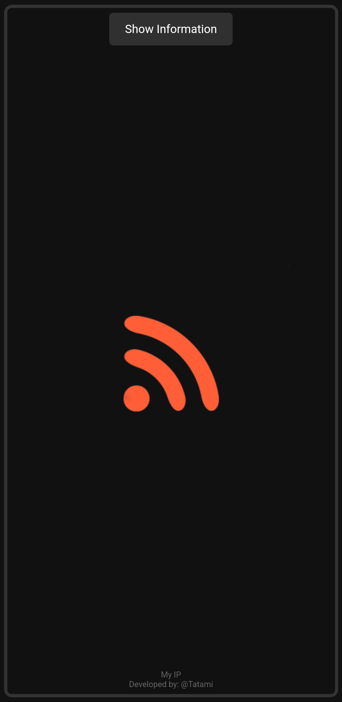
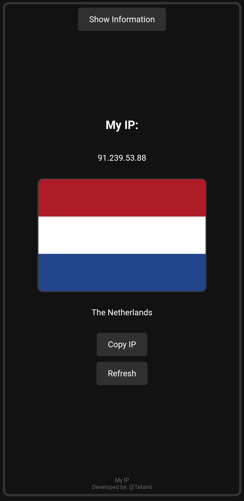
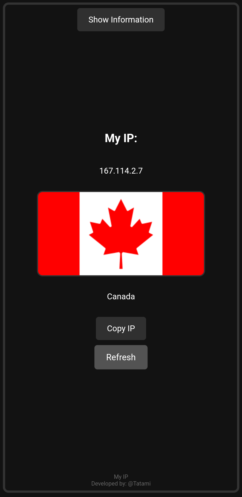

# Description

  
  <h1>My IP</h1>

# My IP

Welcome to the project! See the following documentation for more details:

- [Capacitor App Setup Guide](INSTALATION.md)

- [ Documentation](DOCUMENTATION.md)

"My IP" is a lightweight Android application designed to quickly display your current IP address and its associated country flag. It is ideal for users who want real-time information about their internet connection, whether they are using Wi-Fi, mobile networks, VPNs, or proxies.

## Screenshots

  
  
  

  
  
  

## Features

- Displays your current public IP address.
- Shows the country and flag associated with your IP address.
- Provides a "Refresh" button to fetch the latest IP information instantly.
- Optimized UI for fast loading and minimal system resource usage.
- Copy your IP address to the clipboard with a simple tap.
- Designed with a simple and user-friendly interface for all users.

# My IP

- [Capacitor App Setup Guide](INSTALATION.md)

- [ Documentation](DOCUMENTATION.md)

- [ Usage Guide](README.md)

## ------------------------------------

