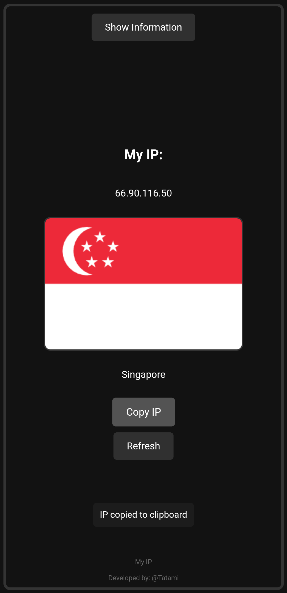

# My-IP

  
  <h1>My IP</h1>

"My IP" is a lightweight Android application designed to quickly display your current IP address and its associated country flag. It is ideal for users who want real-time information about their internet connection, whether they are using Wi-Fi, mobile networks, VPNs, or proxies.

## Features

- Displays your current public IP address
- Shows the country and flag associated with your IP address
- Provides a "Refresh" button to fetch the latest IP information instantly
- Optimized UI for fast loading and minimal system resource usage
- Copy your IP address to the clipboard with a simple tap
- Designed with a simple and user-friendly interface for all users

#### Improvements

- Faster and more reliable IP fetching with built-in network error handling
- Optimized for use with or without VPN/proxy connections
- Dynamic handling of API requests with a refresh control to avoid overloading
- Enhanced support for mobile and tablet devices

## Screenshots

  

  

